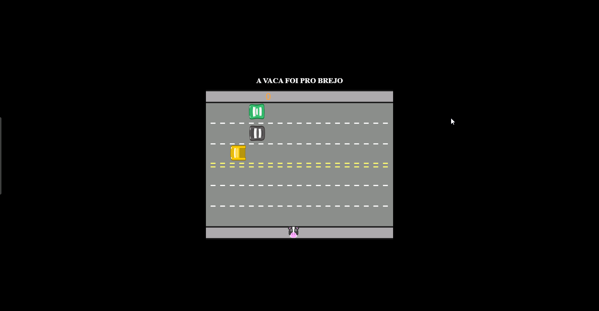

# A vaca foi pro brejo

É sempre bom da uma revisada boa em lógica de programação e esse processo fica melhor na criação de jogos 🎮.

Com a plataforma da Alura junto com o orientado Guilherme Lima refiz o jogo "Freeway” da activision.

Adicionei algumas funções como a opções do personagem (uma vaquinha) poder ir para direita e esquerda para deixa o jogo mais fácil, por outro lado, coloquei carros transitando pelas duas vias para deixa mais desafiador. 😤

Caso ser sinta desafiado a tentar (duvido muito que consiga fazer 10 pontos), só clicar no link ao lado: https://lnkd.in/gJNe-WjK

Projeto Alura de jogos clássicos.
